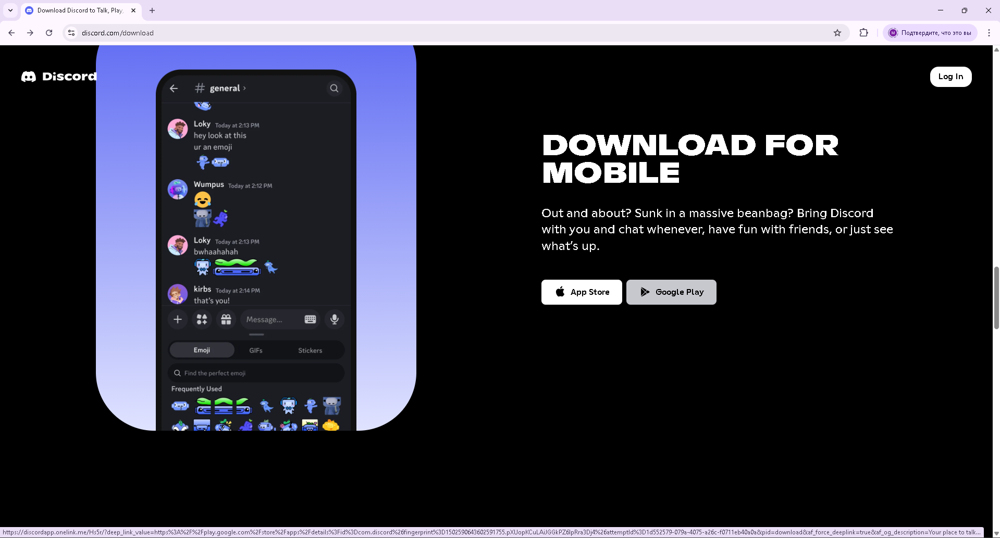
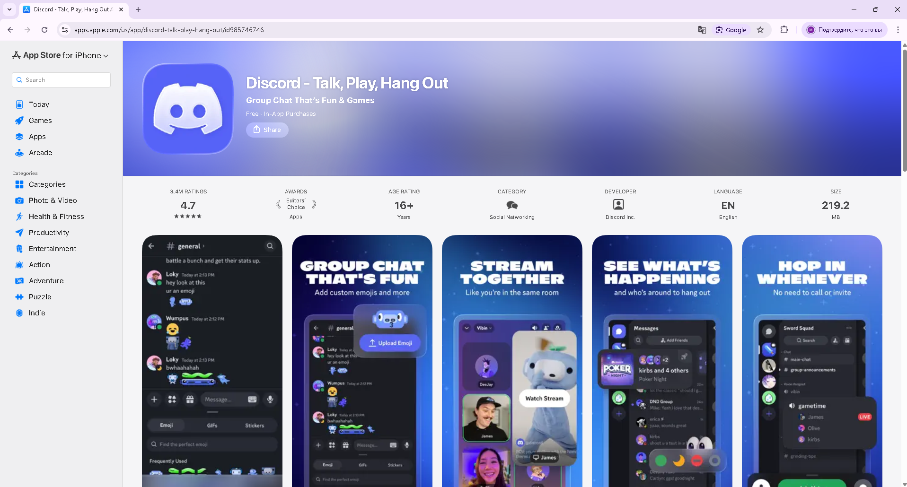

BR-003 — Google Play button redirects to Apple App Store

Summary: 
On the discord.com homepage, the "Download for mobile" section contains two CTA buttons — App Store and Google Play. Clicking the Google Play button incorrectly redirects the user to the Apple App Store page for Discord instead of the Google Play Store listing. Both buttons resolve to the same App Store deep link URL.

Steps to reproduce:

1. Open https://discord.com in Google Chrome on Windows 11.
2. Click on the "Download" button in the page header
3. Scroll down to the "Download for mobile" section.
4. Locate the two download buttons: App Store and Google Play.
5. Click the Google Play button.
6. Observe the destination page that opens in the new tab.

Expected result:
User is redirected to the Google Play Store listing for Discord (play.google.com/…).

Actual result:
User is redirected to the Apple App Store listing for Discord (apps.apple.com/…).

Environment:
Windows 11, Google Chrome 147.0.7727.138 (64-bit), Desktop

Severity: High
Priority: High

Root cause (observed):
The deep_link_value parameter in the Google Play button's OneLink URL points to an App Store URL (itunes.apple.com/…) instead of a Google Play URL (play.google.com/…). Both buttons share the App Store destination, suggesting a copy-paste error in the link configuration.

Notes: 
All desktop users on discord.com who attempt to download Discord for Android are directed to the wrong store. This blocks the Android download conversion funnel entirely and may cause user confusion or loss of installs.

## Attachments
### Google Play button

### Wrong redirect

